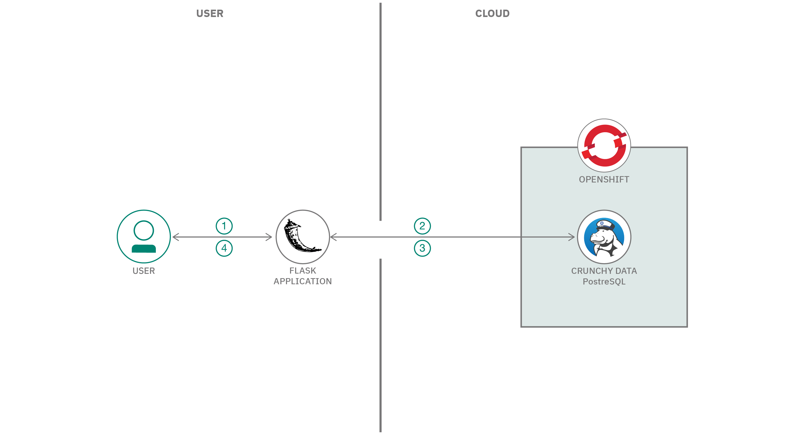
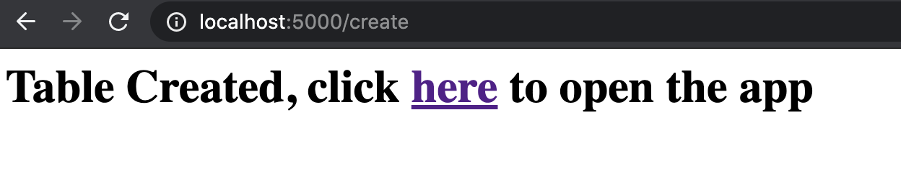
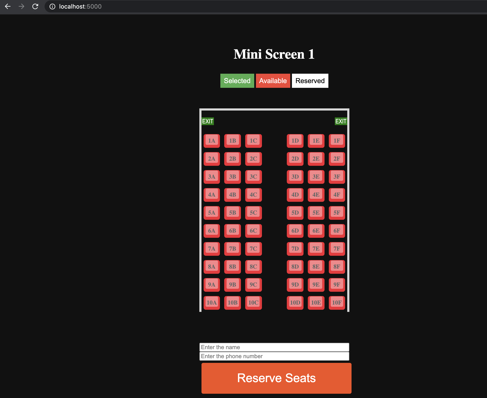
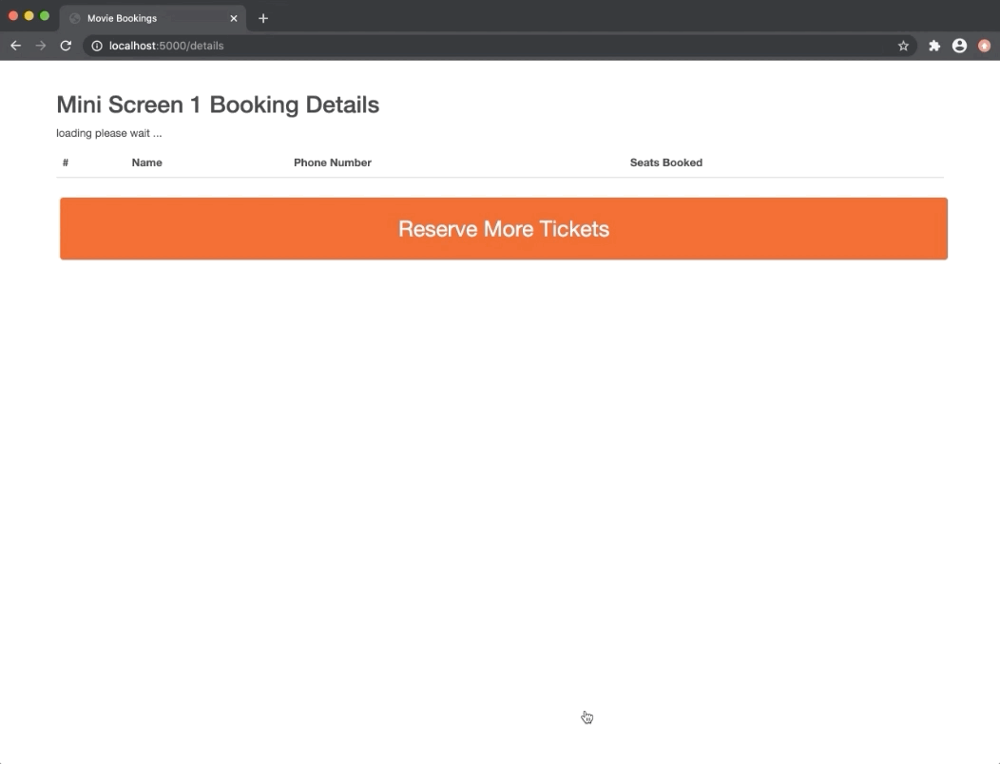
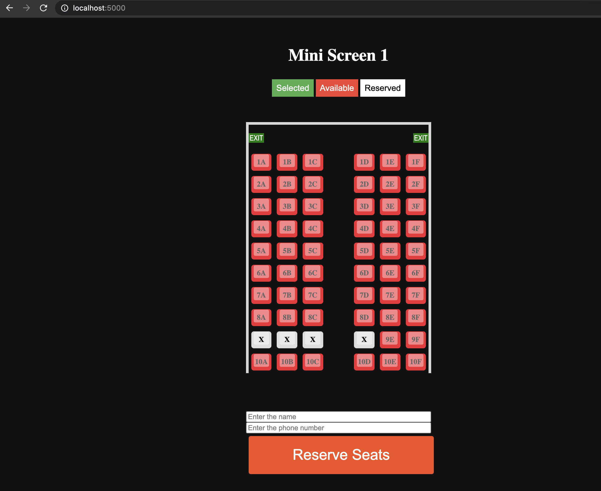

# Build a movie ticket reservation system

In this code pattern, you will build a movie ticket reservation application using Crunchy Data PostgreSQL on Red Hat Marketplace.

After completing this code pattern, you will understand how to:

* Deploy Crunchy PostgreSQL for Kubernetes Operator on an OpenShift cluster.
* Create a CrunchyDB cluster and database.
* Access the cluster on your localhost.
* Connect and access CrunchyDB data from a python flask application.   

<!--add an image in this path-->


<!--Optionally, add flow steps based on the architecture diagram-->
## Flow

1. User enters his details and reserves his seat.
2. Application updates the Crunchy Data PostgreSQL tables accordingly.
3. Application fetches the updated data from the tables.
4. Application displays the updated seats availability data and booking details data that was fetched from the respective tables. 


## Pre-requisites

1. [Red Hat Marketplace Account](https://marketplace.redhat.com/en-us/registration/om).
2. [IBM Managed Red Hat OpenShift Cluster](https://cloud.ibm.com/kubernetes/catalog/create?platformType=openshift).
3. For all operators being installed from Red Hat Marketplace, a Red Hat OpenShift cluster version 4.3 or higher is mandatory. Please set up a classic cluster using the instructions from this URL. [Setting up OpenShift Cluster](https://cloud.ibm.com/docs/openshift?topic=openshift-getting-started)
4. [OC & kubectl CLI](https://docs.openshift.com/container-platform/3.6/cli_reference/get_started_cli.html).

## Steps

1. [Clone the repo](#1-clone-the-repo)
2. [Deploy a Crunchy PostgreSQL for Kubernetes Operator to an OpenShift cluster](#2-deploy-a-crunchy-postgresql-for-kubernetes-operator-to-an-openshift-cluster)
3. [Run the application](#3-run-the-application)
4. [Analyse the results](#4-analyse-the-results)

## 1. Clone the repo
<!--EM: What is included in this repo? Is this the application? If so, I wonder if we should change the title since the reader is not truly building an app, but, rather, connecting an app to a database to track movie ticket reservations-->

Clone the `movie_ticket_booking_application_using_crunchydb` repo locally. In a terminal, run:

```
$ git clone https://github.com/IBM/movie_ticket_booking_application_using_crunchydb
```
## 2. Deploy a Crunchy PostgreSQL for Kubernetes Operator to an OpenShift cluster

Steps to Deploy Crunchy PostgreSQL for Kubernetes Operator from Red Hat Marketplace on OpenShift Cluster can be found at [Steps to Deploy Crunchy PostgreSQL for Kubernetes Operator](https://developer.ibm.com/tutorials/deploy-a-crunchy-posgresql-kubernetes-operator-red-hat-marketplace-openshift/)

## 3. Run the application

To run the application, follow these steps:

### 3.1 Install the dependecies 
   
Go to the cloned repo from [step 1](#1-clone-the-repo). In your terminal, run the following commands to install the required python libraries and run the app
    
 1. Install the required Python libraries by running the following command:

```bash
$ pip install -r requirements.txt
```

 2. Run the application as follows:

```bash
$ python app.py
```
 
### 3.2 Create a table and load it with required data
    
Open the following URL in the browser: `http://localhost:5000/create`


    
Click on the link. This will create `screen` and `userdetails` tables in the `Crunchy Data PostgreSQL` database  and load it with required data.
    
> Note: Please be patient, this step will take a while
    
### 3.3 Open the booking application
   
Open the application by following the promptss or opening the `http://localhost:5000/`.
   
The booking application showing the seats in a theater should lead on your screen.
   
   
    
### 4. Analyze the results

Now, let's play around with the app to see how it works.

1. Select the seats you want, type your name and phone number in the fields and click **Reserve Seats**. 

    
   
1. Your booking will be showcased in the booking details tab <!--EM: I don't see this tab. DO you mean the Reserved tab?-->. Click on `Reserve More Tickets` to reserve more seats.
   
   
   
    The seats you chose will be marked with an X, as shown below:
   
   

1. You can view the tables in the CruncyDB console by running the following commands on the terminal,
   
    `kubectl port-forward -n pgo svc/cpdemo-pgadmin 5050:5050`
   
1. Open the browser with the URL, `http://localhost:5050/`. This will open the console for `Crunchy Data PostgreSQL` database.
   
   > For more details on `Crunchy Data PostgreSQL` console, refer to this [tutorial](https://github.com/IBM/perform-crud-operations-using-crunchy-Postgresaql-for-kubernetes-operator-rhm#step-2-perform-crud-operations-on-crunchydb-using-python)
   
   
<!-- keep this -->

## License

This code pattern is licensed under the Apache License, Version 2. Separate third-party code objects invoked within this code pattern are licensed by their respective providers pursuant to their own separate licenses. Contributions are subject to the [Developer Certificate of Origin, Version 1.1](https://developercertificate.org/) and the [Apache License, Version 2](https://www.apache.org/licenses/LICENSE-2.0.txt).

[Apache License FAQ](https://www.apache.org/foundation/license-faq.html#WhatDoesItMEAN)
   
   

