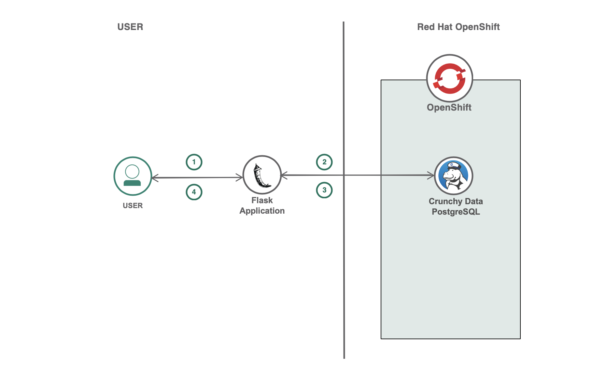

# Short title

Build a movie ticket reservation system

# Long title

Build a movie ticket reservation application using Crunchy Data PostgreSQL on Red Hat Marketplace

# Author

> Provide names and IBM email addresses.

* Rahul Reddy Ravipally <raravi86@in.ibm.com>
* Manoj Jahgirdar <manoj.jahgirdar@in.ibm.com>
* Srikanth Manne <srikanth.manne@in.ibm.com>

# URLs

### Github repo

* [Build a movie ticket reservation application using Crunchy Data PostgreSQL on Red Hat Marketplace](https://github.com/IBM/movie_ticket_booking_application_using_crunchydb)

# Summary

In this code pattern, you will build a movie ticket reservation application using Crunchy Data PostgreSQL on Red Hat Marketplace.

# Technologies

* [Python](https://en.wikipedia.org/wiki/Python_(programming_language)): An open-source interpreted high-level programming language for general-purpose programming.
* [Database](https://en.wikipedia.org/wiki/Database): A database is an organized collection of data, generally stored and accessed electronically from a computer system.

# Description

Seat booking applications are most commonly used in the box office or ticket office for a theater, cinema, or concert hall. In this code pattern, learn how to use the Crunchy Data PostgreSQL hosted on Red Hat Marketplace to build an application that can reserve seats in a movie theater for an individual or a group of individuals. The application can also capture the details of the person who has booked the tickets. You can further enhance this application to send instant notifications and email to confirm booking status. 

# Flow

1. User enters his details and reserves his seat.
2. Application updates the Crunchy Data PostgreSQL tables accordingly.
3. Application fetches the updated data from the tables.
4. Application displays the updated seats availability data and booking details data that was fetched from the respective tables. 

# Instructions

> Find the detailed steps for this pattern in the [readme file](https://github.com/IBM/movie_ticket_booking_application_using_crunchydb/blob/master/README.md). The steps will show you how to:

1. Clone the repo
2. Install the CrunchyDB Operator from Red Hat Marketplace on an OpenShift Cluster
3. Run the application
4. Analyse the results

# Components and services

* [IBM Managed Red Hat OpenShift Cluster](https://cloud.ibm.com/kubernetes/catalog/create?platformType=openshift)
* [Crunchy PostgreSQL for Kubernetes](https://marketplace.redhat.com/en-us/products/crunchy-postgresql-for-kubernetes)

# Runtimes

* Python 3

# Related IBM Developer content

* [Perform CRUD operations using Crunchy PostgreSQL for Kubernetes Operator on Red Hat Marketplace](https://github.com/IBM/perform-crud-operations-using-crunchy-Postgresaql-for-kubernetes-operator-rhm): In this tutorial,Perform CRUD operations using Crunchy PostgreSQL for Kubernetes Operator on Red Hat Marketplace. 
